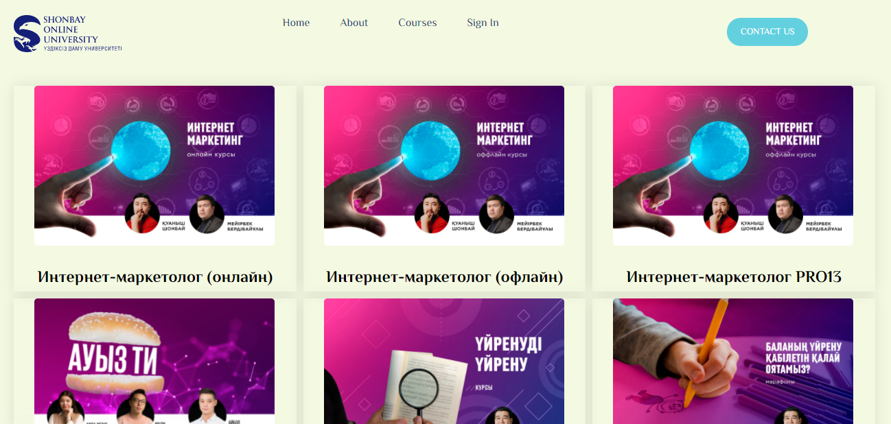
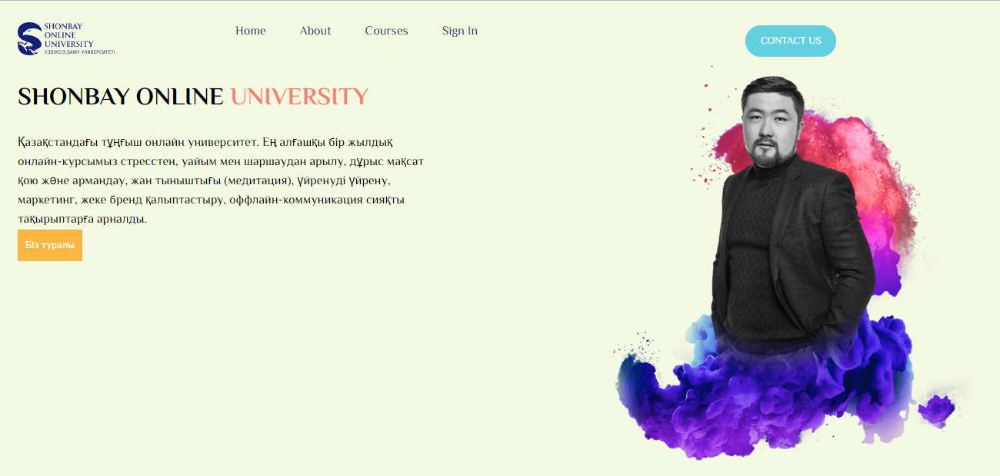
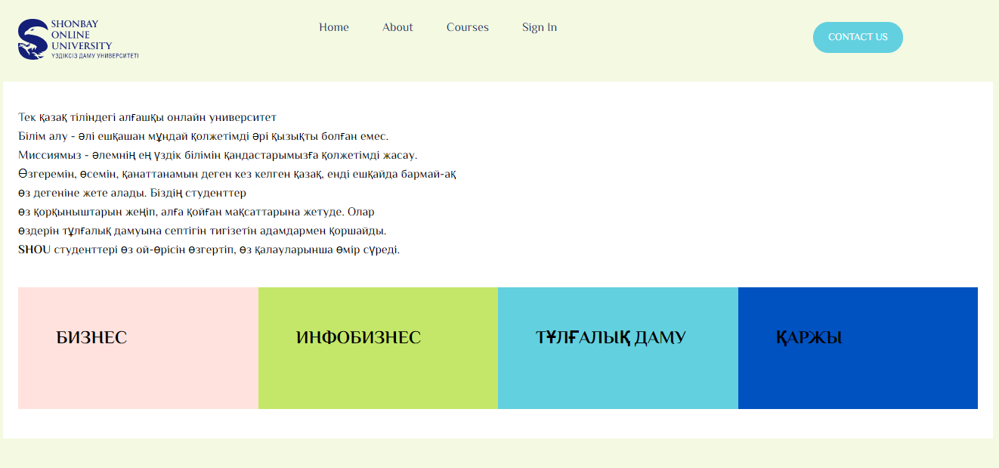
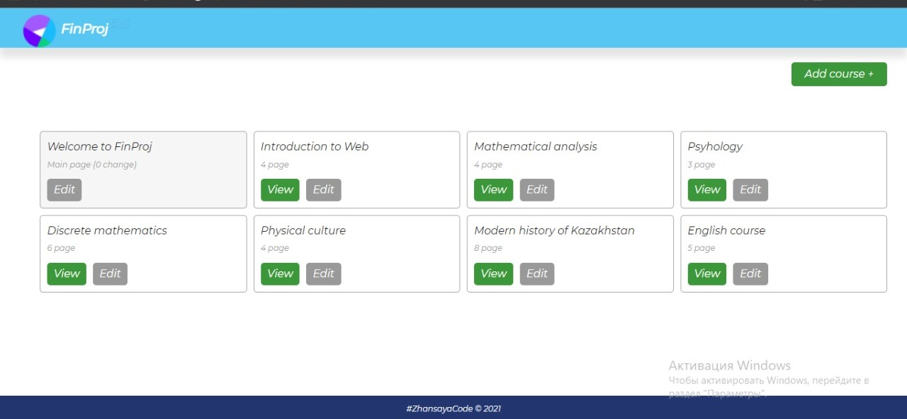
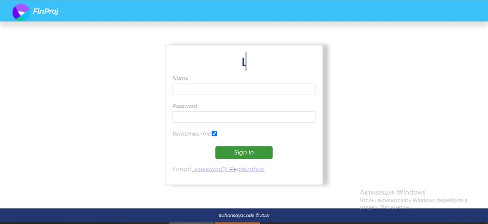
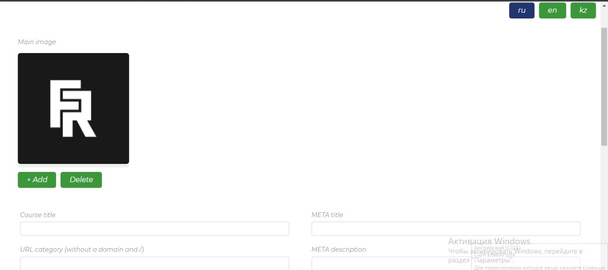

# Online school (final-project)

This is a solution to the [Online School]

## Table of contents

- [Overview](#overview)
  - [Screenshot](#screenshot)
  - [Links](#links)
- [My process](#my-process)
  - [Built with](#built-with)
  - [What I learned](#what-i-learned)
  - [Useful resources](#useful-resources)
- [Author](#author)
- [Acknowledgments](#acknowledgments)

## Overview

### Screenshot

### Links

- Solution URL: https://github.com/Zhansayess03/final-project.git

- Live Site URL: file:///C:/Users/User/Desktop/final%20project/final-project/html-client/about.html

## My process

### Built with

- Started creating with Semantic HTML5 markup
- Added CSS styles
- Use BEM Methodology (Block-Element-Modifier)
- Use CSS Grid
- Use CSS Anımation
- Use Maps
- Deployed result on GitHub pages

### What I learned

This task helped me to better understand and use CSS Grid. I got a lot of information about  Grid creating this site. CSS animations helped me create a visually beautiful page. 

### Useful resources

- W3School JS https://www.w3schools.com/js/default.asp
- MDN CSS Grid Layout https://developer.mozilla.org/ru/docs/Web/CSS/CSS_Grid_Layout/Basic_Concepts_of_Grid_Layout
- Heartbeat animation https://youtu.be/uF_FE9Hz38k
- Hover imag animation https://youtu.be/Zz8A4NqoLrE
- Blink animation https://youtu.be/OMBmcd2fZ7s
- Google Fonts

## Authors

- GitHub - [Esirkepova Zhansaya](https://github.com/Zhansayess03) & [Adilkhan Anel](https://github.com/aneloo2)

## Acknowledgments
 
Thank you for our web development teacher for giving us such a task so that we develop our coding skills. 
